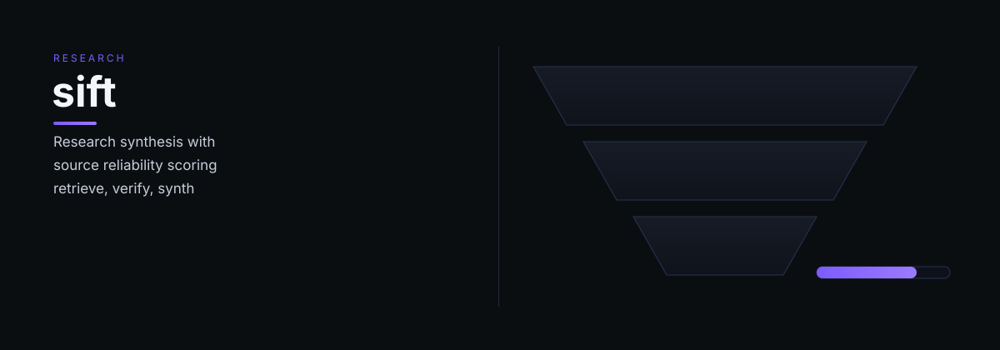

# sift

sift — Sift: research synthesis engine — retrieves, verifies, and synthesizes information from the web with source reliability scoring.

> Tell it what you need. It does the work.

## What it does

Sift selects search depth automatically (quick answer, comparison, deep research, or document analysis), routes queries through a tiered source hierarchy from internal knowledge to semantic research providers, and evaluates reliability through cross-source agreement scoring. It never performs person-focused OSINT — those requests belong with Scout.

## Dependencies

- See `references/integration-notes.md` for the current backend architecture.
- [Weave](https://github.com/<agent-handle>/weave) — entity disambiguation
- Brave Search API, SearXNG, DuckDuckGo, Exa, Tavily

---

<<<<<<< HEAD
*Sift is part of the [OCAS Agent Suite](https://github.com/<agent-handle>).*
=======
*sift is part of the [OCAS Agent Suite](https://github.com/indigokarasu).*
>>>>>>> d3cbdbc (beautify README: dynamic hero + restructured content (consistent palette))
